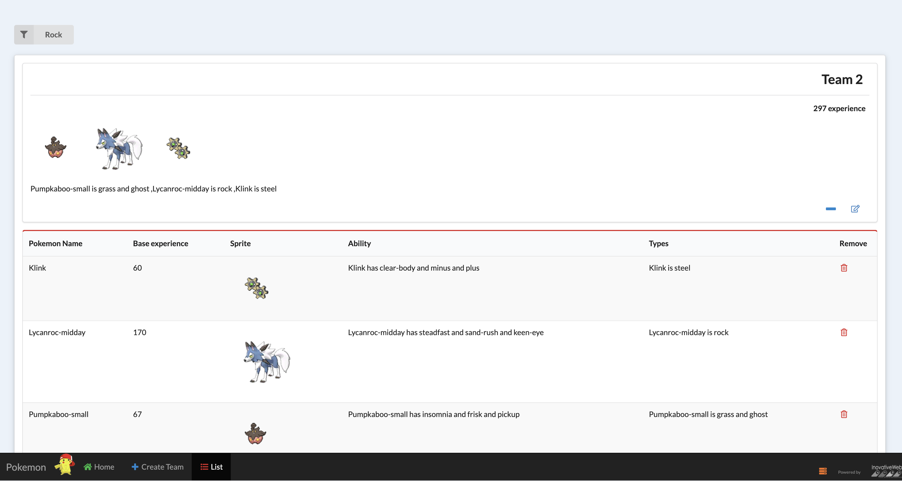
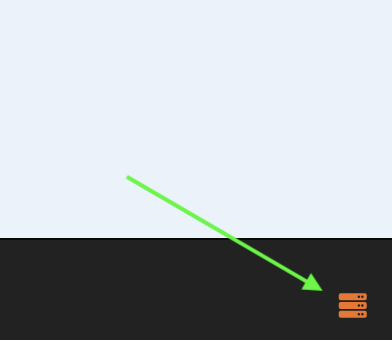

 ## POKEMON TEAMS API nodeJS
 
 
 
 
  ## How to run
 
 Dependencies:
 
   * [Docker for Mac/Windows](https://www.docker.com/get-started) > must installed
 
  ## Install 
  Run in Docker
 docker-compose up
  use -d flag to run in background
  
  To re-build
 docker-compose build
 
 
 
 ## Services exposed
 
 | Service | Port | Notes |
 | --- | --- | --- |
 | MySQL | 3306 | --- |
 | phpMyadmin | 5000 | --- |
   NodeJs| 80 | ---
 
   * MySQL to port 3306
   * NodeJs to port 3000 
   * phpMyadmin 5000 
   
   
   ## Hosts within your environment
   
   You'll need to configure your application to use any services you enabled:
   
   | Service | Port | Notes |
   | --- | --- | --- |
   | MySQL | 3306 | --- |
   | NodeJS | 80 | --- |

##Specifications
A new pokemon tournament is coming soon and you must create a strong team to try to excel at the competition!

By using the Pokemon API at https://pokeapi.co/ it will be satisfied the following requirements:
1) "Create Team" page available at route /team/create
As a Pokemon Trainer:
- Define the name of a new team
- Add a new pokemon to the team by clicking the button "Gotta Catch 'Em All":
- A random pokemon is retrieved from the API and added to the team
		- The added pokemon will show:
			- its name
			- its base_experience value
			- a representative sprite image
			- its abilities (e.g. bulbasaur has chlorophyll and overgrow)
			- its types (e.g. bulbasaur is poison and grass)
2) "Team Listing" page available at route /team/list

As a Pokemon Trainer:
- I want to see the list of all the teams I have created
- Each team shows:
- the name of the team
- the images of all the the pokemons
- the sum of their base_experiences
- the list of their types
		- the teams are sorted by creation date where the most recent is on top.
- Filter by the types of pokemons.
- The listing must use a cache mechanism

3) "Team Edit" page available at route /team/{team-id}/edit
As a Pokemon Trainer, by clicking on the link of a row in the list, you can go to the form to modify the properties of the team.

## Recommendations

For develop, use nodemon to track changes in files and 
automatically restart node server

## License
[MIT](/LICENSE)